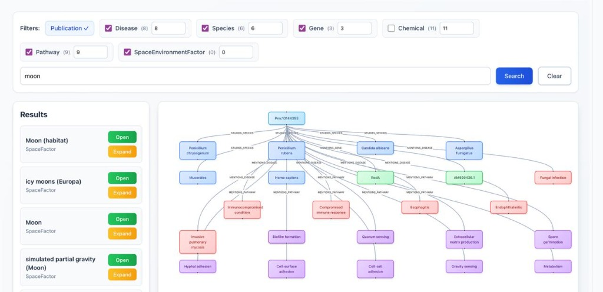
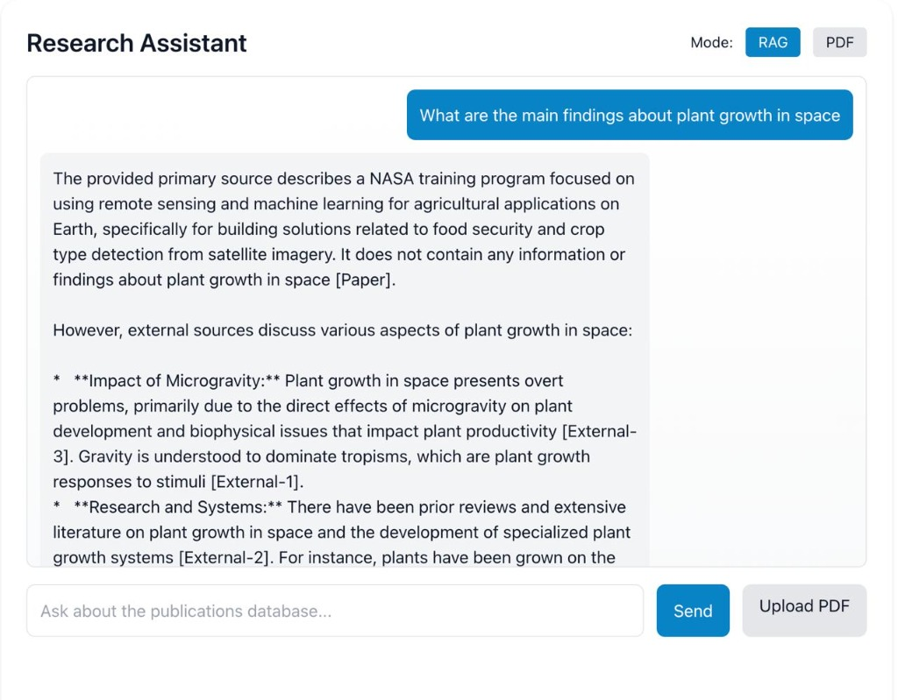
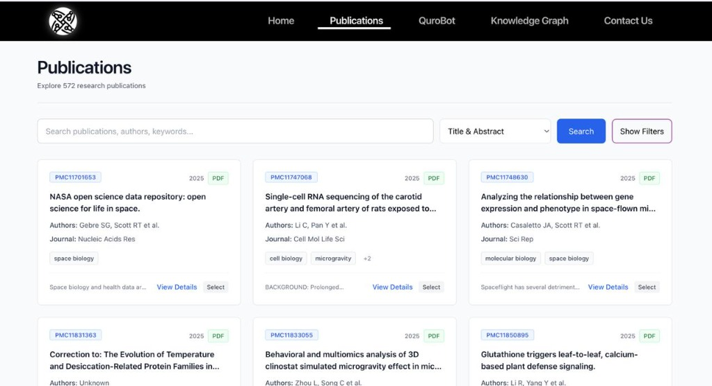
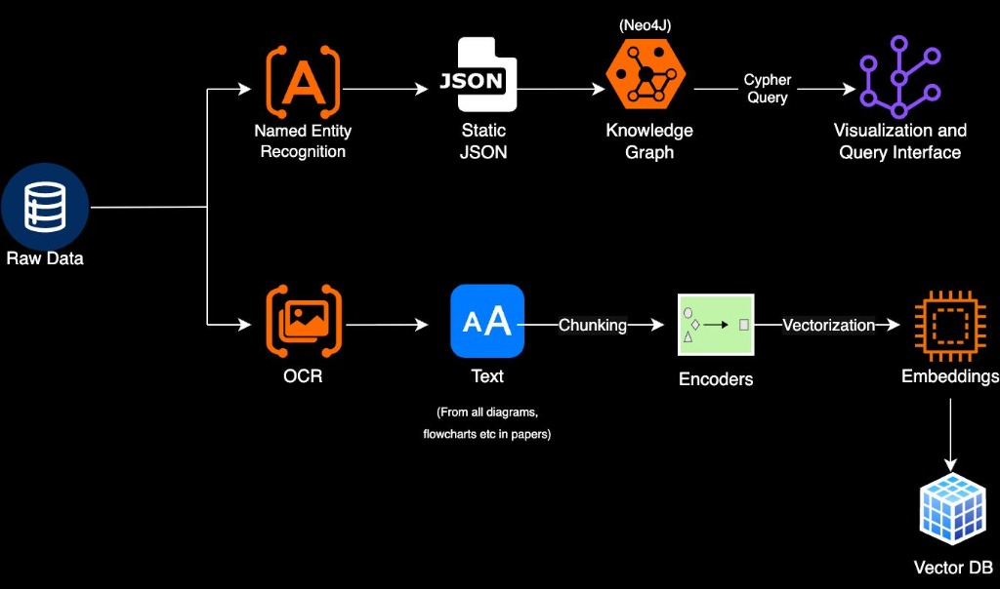
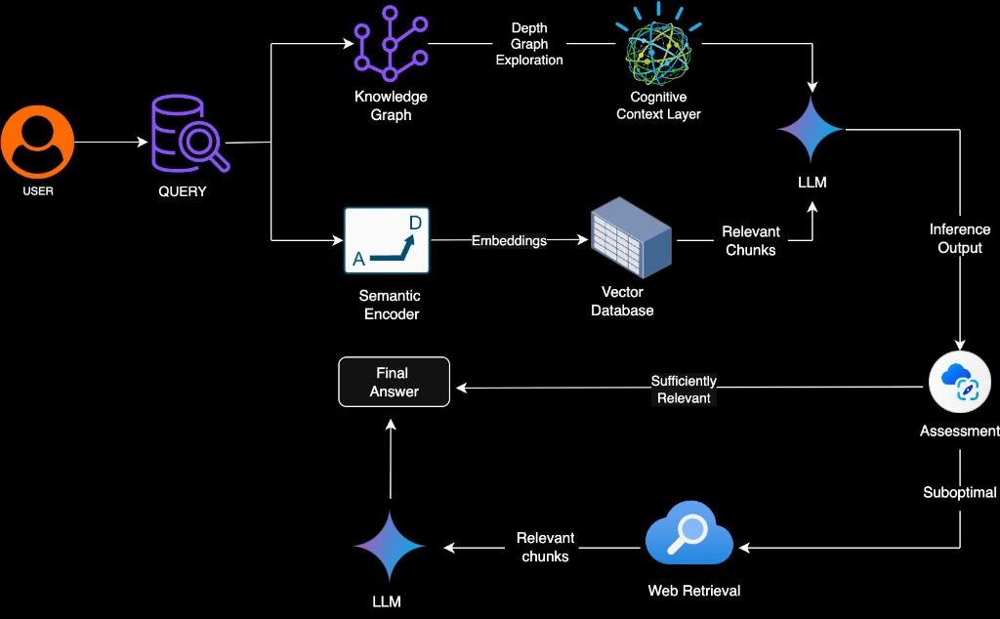

<div align="center">
  
  
  
  

  <h1>🌌 Quro — NASA Bioscience Research Platform</h1>
  
  <p>
    An AI-powered research platform combining advanced intelligence, semantic search, and interactive knowledge visualization to help scientists explore and connect complex space bioscience data.
  </p>
</div>

---

## 📸 Screenshots & Visuals

<div align="center">
  
  <br />
  
  
</div>

### 🏗️ Architecture Diagrams
<div align="center">
  
  
</div>

---

## 🚀 Features & Architecture

Quro integrates multiple AI-driven components to deliver a complete end-to-end research experience.

### 🤖 AI-Powered Research Assistant (QuroBot)
- **Dual Modes:** Features a massive RAG database for semantic search across 500+ publications, and a dynamic PDF analyzer to upload and query any local research papers.
- **Engine:** Powered by **Google Gemini**, **Qdrant**, and **Sentence Transformers**.

### 🕸️ Interactive Knowledge Graph
- **Engineered with Neo4j Aura**: Visually map and explore interactive research themes, complex relationships, and interconnected scientific nodes.

### 📚 Comprehensive Publication Database
- **Vast Repository:** Over 500+ heavily structured NASA Bioscience research papers.
- **Rich Querying:** Advanced filtering, strict MeSH term categorization, and deep semantic search capabilities.

### 💻 Modern User Interface
- **Dashboard:** Sleek, intuitive, and extremely responsive.
- **Stack:** Built using **React 18**, **Tailwind CSS**, **React Router**, and **React Flow**.

---

## ⚙️ Data Pipeline Architecture

Our automated backend pipeline ensures data is always structured and highly searchable:
1. **Automated Ingestion** from PubMed Central (PMC).
2. **Parsing & Extraction** via automated PDF downloads.
3. **Categorization** using intelligent MeSH term tagging.
4. **Vectorization** with Sentence-Transformer embeddings stored dynamically in Qdrant.
5. **Graph Construction** to map relationships directly into Neo4j.

---

## 📂 Project Structure

```text
QURO/
├── backend/
│   ├── main.py                # FastAPI entry point
│   ├── QuroBot.py             # LLM & RAG Agent logic
│   ├── graph_api.py           # Neo4j integration
│   ├── ingestion.py           # Automated PMC data pipeline
│   ├── requirements.txt       
│   └── .env                   # API Keys and Environment secrets
│
└── nasa-bioscience-frontend/
    ├── src/
    │   ├── components/        # Reusable React components
    │   ├── pages/             # Dashboard and QuroBot views
    │   ├── services/          # Axios API endpoints
    │   └── utils/
    ├── tailwind.config.js
    └── package.json
```

---

## 🛠️ Installation & Setup

### Prerequisites

| Tool | Version | Purpose |
|------|----------|----------|
| **Python** | 3.8+ | Backend API Core |
| **Node.js** / **npm** | v24.1.0 / 11.3.0 | Frontend Environment |
| **Neo4j Aura** | Latest | Knowledge Graph Database |
| **Qdrant Cloud** | Latest | Vector Database for Semantic Search |

### 1. Environment Configuration (`backend/.env`)

Create a `.env` file inside the `backend/` directory:

```bash
# Core AI & Databases
GEMINI_API_KEY=your_gemini_api_key
QDRANT_URL=your_qdrant_instance_url
QDRANT_API_KEY=your_qdrant_api_key
NEO4J_URI=your_neo4j_uri
NEO4J_USER=your_neo4j_username
NEO4J_PASSWORD=your_neo4j_password
SERP_API_KEY=your_serp_api_key

# PubMed Pipeline Configuration
PUBMED_EMAIL=your@gmail.com
RATE_LIMIT_DELAY=1.0
PDF_DOWNLOAD_DELAY=2.0
MAX_RETRIES=3
MAX_CONCURRENT_DOWNLOADS=5

# Data Paths
CSV_FILE_PATH=data/SB_publication_PMC.csv
JSON_OUTPUT_PATH=publications.json
PDF_DOWNLOAD_PATH=pdfs
SCHEMA_PATH=schemas
```

### 2. Backend Initialization (FastAPI)

```bash
cd backend
python -m venv venv

# Activate Environment
source venv/bin/activate     # macOS/Linux
venv\Scripts\activate        # Windows

# Install & Run
pip install -r requirements.txt
uvicorn main:app --reload
```
> **Note:** The backend server will be running on `http://localhost:8000`

### 3. Frontend Initialization (React)

```bash
cd nasa-bioscience-frontend
npm install
npm start
```
> **Note:** The frontend application will be running on `http://localhost:3000`

---

## 🐛 Troubleshooting

| Issue | Possible Fix |
|-------|--------------|
| **Backend not starting** | Verify Python environment and run `pip install -r requirements.txt` again. |
| **Database Connection Errors** | Check that `NEO4J_URI` and `QDRANT_URL` in `.env` are accurate and active. |
| **PDF Not Processing** | Ensure the `backend/pdfs/` directory exists and has the correct write permissions. |
